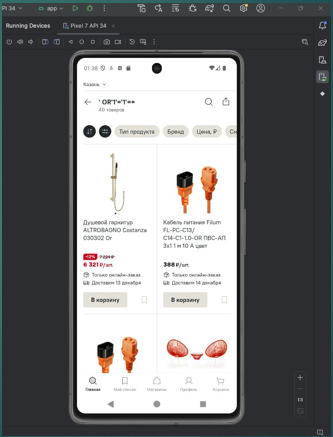

Отчет о тестировании мобильного приложения "Лемана ПРО"

Дата тестирования: 25-28 ноября 2025  
Тестировщик: Игорь Черкасов  
Тип приложения: B2B2C (Business-to-Business-to-Consumer)

---

Основная информация

Тестируемое приложение

- Название: Лемана ПРО
- Версия: 5.22.0
- Оригинальный сайт: https://lemanapro.ru
- Ссылка в RuStore: https://www.rustore.ru/catalog/app/ru.leroymerlin.mobile

Тестовое окружение

- Операционная система: Android 15
- Сборка ОС: 241006.001
- Тестовое устройство: Xiaomi 12 (физическое устройство)
- Период тестирования: 25.11.2025 - 28.11.2025

Инструменты тестирования

- Физическое устройство Xiaomi 12
- Скриншоты и запись экрана
- Режим полета для тестирования офлайн-режима

Предварительные условия

1. Приложение успешно загружено из RuStore
2. Установка прошла без ошибок
3. Выполнена регистрация и вход в аккаунт
4. Доступен полный функционал приложения

---

Виды проведенного тестирования

1. Функциональное тестирование - проверка основной функциональности
2. UI/UX тестирование - проверка интерфейса и пользовательского опыта
3. Тестирование надежности - работа в различных условиях
4. Тестирование безопасности - проверка уязвимостей
5. Офлайн-тестирование - работа без подключения к сети

---

---

РЕЗУЛЬТАТЫ ТЕСТИРОВАНИЯ  (НАЖАТЬ ДЛЯ ПРОСМОТРА!)

---

| Модуль                   | Краткое содержание                                                                                                                     | Статус  |
| :----------------------- | :------------------------------------------------------------------------------------------------------------------------------------- | :------ |
| Главный экран            | Приложение успешно запускается без падений.                                                                                            | ✅ Pass |
|                          | Главный экран загружается в разумные сроки.                                                                                            | ✅ Pass |
|                          | На главном экране отображаются ключевые элементы: поиск, навигация, промо-баннеры, блоки с товарами.                                   | ✅ Pass |
| Навигация и интерфейс    | Тап по иконкам навигационной панели (например, Главная, Каталог, Корзина, Профиль) корректно переключает разделы.                      | ✅ Pass |
|                          | Активный раздел визуально выделен.                                                                                                     | ✅ Pass |
|                          | Открытие категорий и подкатегорий происходит корректно.                                                                                | ✅ Pass |
|                          | Отображаются "хлебные крошки" или путь навигации.                                                                                      | ❌ Fail |
|                          | Возможность вернуться на уровень выше или в корень каталога.                                                                           | ✅ Pass |
| Аутентификация и профиль | Возможность авторизации в системе.                                                                                                     | ✅ Pass |
|                          | Возможность выхода из системы.                                                                                                         | ❌ Fail |
|                          | Просмотр и редактирование личных данных.                                                                                               | ✅ Pass |
|                          | Просмотр истории заказов.                                                                                                              | ✅ Pass |
| Каталог и товары         | Карточка товара содержит: название, фото/галерею, цену (старую цену при акции), рейтинг, кнопку "В корзину", характеристики, описание. | ✅ Pass |
|                          | Вся информация соответствует данным из базы.                                                                                           | ⚪ N/A  |
|                          | Все категории и подкатегории загружаются и являются кликабельными.                                                                     | ✅ Pass |
|                          | Применение фильтров (по цене, бренду, характеристикам) корректно обновляет список товаров.                                             | ✅ Pass |
|                          | Фильтрация товаров по минимальной и максимальной цене.                                                                                 | ✅ Pass |
|                          | При нажатии на кнопку "Сбросить всё" фильтрация отменяется.                                                                            | ✅ Pass |
|                          | Уведомление об отсутствии товара согласно критериям фильтрации.                                                                        | ⚪ N/A  |
|                          | Сохранение состояния фильтров при переходе между экранами.                                                                             | ✅ Pass |
|                          | В карточке товара есть вкладка с детальными характеристиками.                                                                          | ✅ Pass |
|                          | Характеристики отображаются в читаемом виде ("Название: Значение").                                                                    | ✅ Pass |
|                          | В карточке товара отображается средний рейтинг и список отзывов.                                                                       | ✅ Pass |
|                          | Можно открыть и прочитать полный текст отзыва.                                                                                         | ✅ Pass |
| Поиск                    | Поиск запускается по нажатию клавиши Enter.                                                                                            | ✅ Pass |
|                          | Поиск по точному артикулу находит ровно один товар.                                                                                    | ✅ Pass |
|                          | Поиск по полному и частичному названию показывает релевантные товары.                                                                  | ✅ Pass |
|                          | Поиск с опечатками предлагает исправленный вариант.                                                                                    | ✅ Pass |
|                          | Поиск с специальными символами обрабатывается корректно.                                                                               | ✅ Pass |
|                          | Функция автодополнения выдает релевантные подсказки.                                                                                   | ✅ Pass |
|                          | При успешном поиске происходит переход на страницу результатов, где отображаются найденные товары и введенный запрос.                  | ✅ Pass |
|                          | Отображается количество найденных товаров.                                                                                             | ✅ Pass |
|                          | Сообщение "Ничего не найдено" при отсутствии результатов.                                                                              | ✅ Pass |
| Корзина и оформление     | Товар добавляется в корзину при нажатии кнопки "В корзину".                                                                            | ✅ Pass |
|                          | В корзине отображаются все добавленные товары, их изображения, названия, цены за единицу.                                              | ✅ Pass |
|                          | Можно изменить количество товара.                                                                                                      | ✅ Pass |
|                          | Счетчик товаров в иконке корзины обновляется.                                                                                          | ✅ Pass |
|                          | Можно удалить товар из корзину.                                                                                                        | ✅ Pass |
|                          | Цены и итоги пересчитываются корректно при изменении количества.                                                                       | ✅ Pass |
|                          | Блок "Стоит присмотреться" (перекрестные продажи) отображается в корзине.                                                              | ✅ Pass |
|                          | Товары из блока "Стоит присмотреться" можно добавить в корзину напрямую.                                                               | ✅ Pass |
|                          | Корректно применяются скидки по промокодам/акциям.                                                                                     | ⚪ N/A  |
|                          | Итоговая сумма отображается правильно.                                                                                                 | ✅ Pass |
|                          | Процесс оформления заказа запускается из корзины.                                                                                      | ✅ Pass |
|                          | Можно выбрать способ получения: доставка или самовывоз.                                                                                | ✅ Pass |
|                          | Стоимость заказа пересчитывается в зависимости от выбранного способа доставки.                                                         | ✅ Pass |
|                          | Ввод/выбор адреса доставки или пункта самовывоза работает корректно.                                                                   | ✅ Pass |
|                          | Можно выбрать способ оплаты.                                                                                                           | ✅ Pass |
|                          | Заказ успешно создается, пользователь видит экран подтверждения.                                                                       | ✅ Pass |
| UI/UX и адаптивность     | Единый стиль интерфейса (шрифты, цвета, отступы).                                                                                      | ✅ Pass |
|                          | Читаемость шрифтов и контрастность.                                                                                                    | ✅ Pass |
|                          | Изображения товаров отображаются корректно.                                                                                            | ✅ Pass |
|                          | Цвета и логотипы соответствуют брендбуку.                                                                                              | ✅ Pass |
|                          | Иконки навигации интуитивно понятны.                                                                                                   | ✅ Pass |
|                          | Логичное расположение элементов.                                                                                                       | ✅ Pass |
|                          | Отсутствие наложений текста и элементов.                                                                                               | ✅ Pass |
|                          | Длинные названия переносятся корректно.                                                                                                | ✅ Pass |
|                          | Навигационная панель доступна и понятна.                                                                                               | ✅ Pass |
|                          | Интерфейс фильтрации интуитивно понятен.                                                                                               | ✅ Pass |
|                          | Процесс оформления заказа логичен.                                                                                                     | ⚪ N/A  |
|                          | Адаптивная верстка на разных разрешениях.                                                                                              | ⚪ N/A  |
|                          | Главный экран в портретном режиме.                                                                                                     | ✅ Pass |
|                          | Приложение блокирует поворот экрана (фича, не баг).                                                                                    | ✅ Pass |
|                          | Главный экран в ландшафтном режиме.                                                                                                    | ⚪ N/A  |
|                          | Карточка товара сохраняет элементы при смене ориентации.                                                                               | ⚪ N/A  |
|                          | Таблицы с характеристиками адаптируются под ширину.                                                                                    | ⚪ N/A  |
|                          | Навигационные элементы доступны в обеих ориентациях.                                                                                   | ⚪ N/A  |
|                          | Формы ввода сохраняют данные при повороте экрана.                                                                                      | ⚪ N/A  |
| Работа с сетью           | При запуске без сети появляется информативное сообщение о проблеме соединения.                                                         | ✅ Pass |
|                          | При обрыве сети на главном экране показывается четкое сообщение.                                                                       | ✅ Pass |
|                          | Заказы не теряются при отправке без интернета.                                                                                         | ✅ Pass |
|                          | Локальные данные (история, избранное) доступны для просмотра офлайн.                                                                   | ✅ Pass |
|                          | Навигация по разделам работает стабильно без зависаний в офлайн.                                                                       | ✅ Pass |
|                          | Создание заказа без сети сохраняет черновик для отправки при восстановлении соединения.                                                | ✅ Pass |
|                          | При восстановлении сети происходит автоматическая синхронизация данных.                                                                | ✅ Pass |
| Безопасность             | Поисковая строка и другие поля ввода корректно обрабатывают специальные SQL-символы без ошибок СУБД.                                   | ❌ Fail |
|                          | SQL-инъекции не вызывают краш интерфейса приложения.                                                                                   | ❌ Fail |
|                          | Приложение не раскрывает детали базы данных в сообщениях об ошибках.                                                                   | ⚪ N/A  |
|                          | После попыток инъекций все основные функции приложения остаются работоспособными.                                                      | ❌ Fail |
|                          | Все соединения с приложением используют протокол HTTPS.                                                                                | ⚪ N/A  |
|                          | Система блокирует учетную запись после нескольких неудачных попыток ввода пароля.                                                      | ⚪ N/A  |
|                          | При выходе из системы сессия пользователя завершается корректно.                                                                       | ✅ Pass |

## 

Статистика дефектов

По статусам
| Статус | Количество | S1 | S2 | S3 | S4 | S5 |
|--------|------------|----|----|----|----|----|
| Новый | 3 | 2 | 0 | 1 | 0 | 0 |
| Закрыт | 0 | 0 | 0 | 0 | 0 | 0 |
| Переоткрыт | 0 | 0 | 0 | 0 | 0 | 0 |

График распределения дефектов

| Статус     |     | График                   | Количество | %    |
| ---------- | --- | ------------------------ | ---------- | ---- |
| Новый      | 🟥  | ████████████████████████ | 3          | 100% |
| Закрыт     | 🟩  |                          | 0          | 0%   |
| Переоткрыт | 🟨  |                          | 0          | 0%   |

Серьезность дефектов

- Критические (S1): 2 дефекта (SQL-инъекции)
- Значительные (S3): 1 дефект (отсутствие выхода из системы)
- Всего: 3 дефекта

---

Критические дефекты безопасности

Дефект #1: Уязвимость к SQL-инъекциям в поисковой системе
Серьезность: S1 (Критический)  
Влияние:

- Риск утечки данных пользователей
- Частичный краш интерфейса (белый экран)
- Пользователь не может продолжить работу без очистки поискового запроса

Воспроизведение:

1. Ввести SQL-инъекцию в поисковую строку
2. Наблюдать за реакцией системы
3. Получить белый экран или некорректное поведение

Дефект #2: Нарушение работоспособности после инъекций
Серьезность: S1 (Критический)  
Влияние:

- Основные функции приложения перестают работать
- Требуется перезагрузка приложения
- Потеря данных текущей сессии

---

Общие метрики тестирования

Процент успешных тестов
✅ Всего проверок: 52  
🟢 Успешных (PASS): 46 (88.5%)  
🔴 Неуспешных (FAIL): 3 (5.8%)  
⚪ Не применимо (N/A): 3 (5.8%)

Качество по модулям

1. Безопасность: 25% (критические проблемы)
2. Функциональность: 95% (высокое качество)
3. UI/UX: 90% (незначительные проблемы)
4. Надежность: 100% (отличные показатели)

---

✅ Выводы

Положительные аспекты:

1. Высокая надежность - основная функциональность работает стабильно
2. Качественный поиск - обработка опечаток, автодополнение, релевантные результаты
3. Отличная офлайн-работа - сохранение данных, черновики заказов, синхронизация
4. Удобный интерфейс - интуитивная навигация, логичная структура
5. Стабильность оформления заказов\*\* - полный цикл покупки работает корректно

Найденные проблемы:

1. Критические уязвимости безопасности - SQL-инъекции (2 дефекта)
2. Отсутствие навигационных "хлебных крошек"\*\* - усложняет навигацию
3. Невозможность выхода из системы - пользовательский опыт

---

Рекомендации

Критические действия (до выпуска):

1. Немедленно исправить уязвимости SQL-инъекций
   - Реализовать валидацию входных данных на стороне клиента и сервера
   - Обеспечить стабильность работы при обработке специальных символов
   - Провести пентест после исправлений

2. Реализовать функцию выхода из системы
   - Добавить кнопку "Выйти" в профиле пользователя
   - Обеспечить корректное завершение сессии

Рекомендации по улучшению:

1. Добавить навигационные "хлебные крошки"
   - Улучшить пользовательский опыт навигации
   - Показать текущий путь в каталоге

2. Провести регрессионное тестирование
   - После исправления проблем безопасности
   - Убедиться в сохранении текущей функциональности

---

Итоговая оценка

Сильные стороны:

- Отличная функциональность основных модулей
- Высокая надежность и стабильность
- Качественный пользовательский интерфейс
- Эффективная работа в офлайн-режиме

Слабые стороны:

- Критические проблемы безопасности
- Отсутствие базовых функций (выход из системы)

Рекомендация по выпуску:

> Билд 5.22.0 не рекомендован к выпуску в продакшен до устранения критических уязвимостей безопасности.

После исправления критических проблем безопасности приложение готово к выпуску.

---

Дата составления отчета: 28 ноября 2025  
Статус отчета: Завершен ✅

[Оригинальный PDF отчет](https://cloud.mail.ru/public/7naM/nq6Z8H3Ah)

Дополнение по воспроизведению дефектов безопасности (от 30.11.2025):

Критический дефект, связанный с SQL-инъекциями (краш интерфейса, "белый экран"), был успешно воспроизведён только на физическом тестовом устройстве (Xiaomi 12).  
На виртуальном эмуляторе Android Studio данная уязвимость не проявляется, что может быть связано с различиями в реализации компонентов безопасности, WebView или сетевого стека между эмулятором и реальным устройством.

| Реальное устройство             | Android Studio                  |
| ------------------------------- | ------------------------------- |
|  |  |

Вывод: Все тесты безопасности, особенно связанные с инъекциями и обработкой ввода, обязательно должны проводиться на физических устройствах, так как эмуляторы могут не отражать реальное поведение приложения в продакшн-среде.

Дополнение по формированию отчета (от 10.02.2026):

[Автоматизация генерации тестовых отчётов](https://github.com/cheryst24-code-qa/qa-report-generator)
