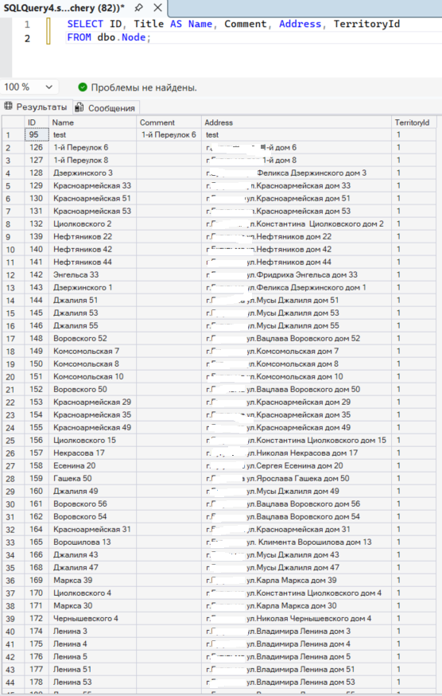
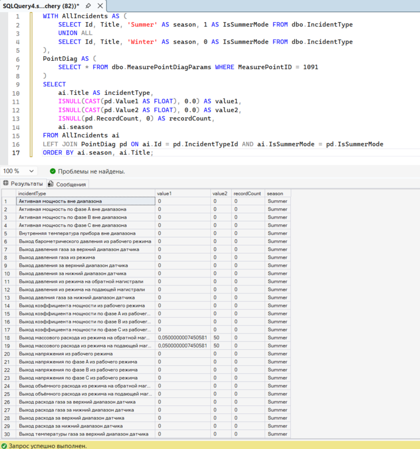
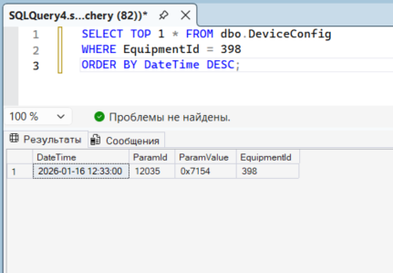
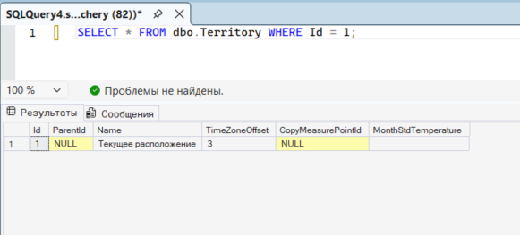
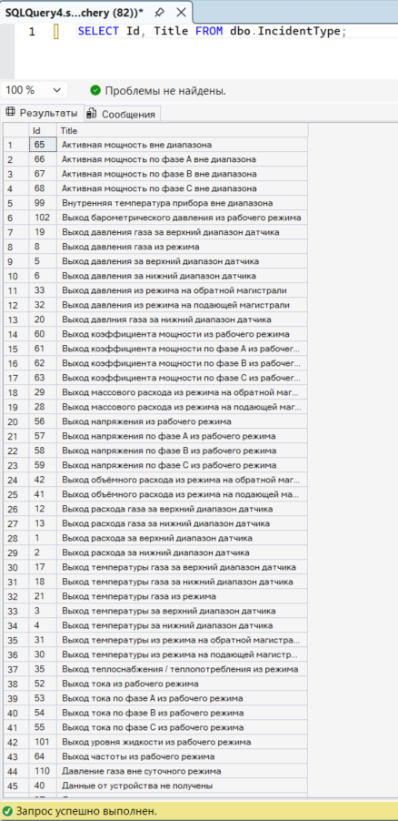

## Тестирование через данные: работа с БД LERS (MSSQL)

Как тестировщик энергосистемы, я верифицирую корректность обработки данных на уровне СУБД - 
от простых проверок целостности до построения эталонных наборов для автоматизированных тестов.
Все запросы выполнялись в тестовом окружении с правами **только на чтение**.


### Проверка тестового аккаунта в системе LERS:

**Задача:** 

Убедиться, что тестовый аккаунт `test` корректно настроен для выполнения авторизационных тестов.

**SQL-запрос:**  
```sql
SELECT * 
FROM dbo.Account 
WHERE Account_Login = 'test';
```
| Пример             |
| -------------------|
|  |

---

### Верификация иерархии энергообъектов в системе LERS:

**Задача:**

Проверка целостности структуры данных по иерархии: "Группа узлов" -> "Узел" -> "Точка измерения" и системе учёта LERS. 

#### 1. ОБЪЕКТЫ УЧЁТА (Node)

**SQL-запрос:**  
```sql
SELECT ID, Title AS Name, Comment, Address, TerritoryId
FROM dbo.Node;
```
| Пример             |
| -------------------|
|  |

```sql
SELECT 
    MeasurePoint_ID,
    MeasurePoint_Title,
    MeasurePoint_ServiceNumber
FROM dbo.MeasurePoint
WHERE MeasurePoint_NodeID = 95;
```
| Пример             |
| -------------------|
|  |

```sql
SELECT Id, Title FROM dbo.NodeGroup
```
| Пример             |
| -------------------|
|  |

---

#### 2. ТОЧКИ УЧЁТА (MeasurePoint)
```sql
SELECT 
    MeasurePoint_ID,
    MeasurePoint_Title,
    MeasurePoint_ServiceNumber,
    MeasurePoint_NodeID
FROM dbo.MeasurePoint;
```
| Пример             |
| -------------------|
|  |

```sql
SELECT * FROM dbo.MeasurePoint WHERE MeasurePoint_ID = 1070;
```
| Пример             |
| -------------------|
|  |

---

### Сезонная верификация диагностических параметров в LERS:

**Бизнес-задача:**

Обеспечить 100% покрытие диагностических параметров для всех типов инцидентов в обоих сезонных режимах (лето/зима).
Отсутствие данных для режима = риск пропуска аварийной ситуации.

**SQL-запрос:**  
```sql
WITH AllIncidents AS (
    SELECT Id, Title, 'Summer' AS season, 1 AS IsSummerMode FROM dbo.IncidentType
    UNION ALL
    SELECT Id, Title, 'Winter' AS season, 0 AS IsSummerMode FROM dbo.IncidentType
),
PointDiag AS (
    SELECT * FROM dbo.MeasurePointDiagParams WHERE MeasurePointID = 1091
)
SELECT 
    ai.Title AS incidentType,
    ISNULL(CAST(pd.Value1 AS FLOAT), 0.0) AS value1,
    ISNULL(CAST(pd.Value2 AS FLOAT), 0.0) AS value2,
    ISNULL(pd.RecordCount, 0) AS recordCount,
    ai.season
FROM AllIncidents ai
LEFT JOIN PointDiag pd ON ai.Id = pd.IncidentTypeId AND ai.IsSummerMode = pd.IsSummerMode
ORDER BY ai.season, ai.Title;
```
| Пример             |
| -------------------|
|  |

---

### Верификация часовых интеграторов (тоталов) в системе учёта LERS:

**Бизнес-задача:**

Валидация корректности расчёта накопленных значений энергии (интеграторов) для точки измерения за заданный период,
включая обработку пропусков данных через интерполяцию. 

**SQL-запрос:**  
```sql
WITH RankedData AS (
    SELECT 
        DateTime,
        DataParameterId,
        Value,
        ROW_NUMBER() OVER (
            PARTITION BY DateTime, DataParameterId 
            ORDER BY IsInterpolated, IsCalc
        ) AS rn
    FROM dbo.EavConsumptionValues
    WHERE MeasurePointId = 1093
      AND DateTime >= '2026-01-01'
      AND DateTime < '2026-02-01'
),
HourlyDeltas AS (
    SELECT 
        DateTime,
        MAX(CASE WHEN DataParameterId = 14 THEN Value END) AS V_in,
        MAX(CASE WHEN DataParameterId = 92 THEN Value END) AS NormalOperationDuration,
        MAX(CASE WHEN DataParameterId = 93 THEN Value END) AS StopDuration
    FROM RankedData
    WHERE rn = 1
    GROUP BY DateTime
)
SELECT 
    DateTime,
    V_in,
    NormalOperationDuration,
    StopDuration
FROM HourlyDeltas
ORDER BY DateTime;
```
| Пример             |
| -------------------|
|  |

---

### Верификация оборудования и его конфигурации в системе учёта LERS:

**Бизнес-задача:**

Обеспечить корректность привязки физического оборудования (счётчики, датчики) к точкам измерения и
верифицировать актуальность его конфигурации для точности расчёта потребления.

**SQL-запрос:**  
```sql
SELECT Id, SerialNumber, Comment, EquipmentModelId FROM dbo.Equipment;
```
| Пример             |
| -------------------|
|  |

```sql
SELECT * FROM dbo.Equipment WHERE Id = 341;
```
| Пример             |
| -------------------|
|  |

```sql
SELECT TOP 1 * FROM dbo.DeviceConfig
WHERE EquipmentId = 398
ORDER BY DateTime DESC;
```
| Пример             |
| -------------------|
|  |

---

### Верификация территориальных настроек и часовых поясов в LERS:

**Бизнес-задача:**

Обеспечить корректность временных меток показаний оборудования во всех регионах развёртывания системы.
Ошибка в часовом поясе = искажение профиля нагрузки = финансовые потери при расчёте по зонам суток.

**SQL-запрос:**  
```sql
SELECT Id, Name, TimeZoneOffset FROM dbo.Territory;
```
| Пример             |
| -------------------|
|  |

```sql
SELECT * FROM dbo.Territory WHERE Id = 1;
```
| Пример             |
| -------------------|
|  |

---

### Исследование доменной модели LERS через справочники:

**Задача:**
  
Перед написанием тест-кейсов я провожу структурированное исследование справочников - это позволяет:
- Выявить скрытые зависимости между сущностями;
- Подготовить тестовые данные;
- Спроектировать сценарии на основе реальной конфигурации системы.

**SQL-запрос:**  
```sql
SELECT Id, Title FROM dbo.IncidentType; 
```
| Пример             |
| -------------------|
|  |

```sql
SELECT Id, Title FROM dbo.EquipmentModel;            
SELECT Id, PrecisionClass, NominalDiameter FROM dbo.EquipmentModelModification;
SELECT Id, Title FROM dbo.NodeGroup;
SELECT Id, Title FROM dbo.ServiceCompany;
SELECT Id, Name FROM dbo.Serviceman;
SELECT Unit_ID, Unit_Title FROM dbo.Unit;
SELECT PollPort_ID, GprsListenIPAddress FROM dbo.PollPort;
```
