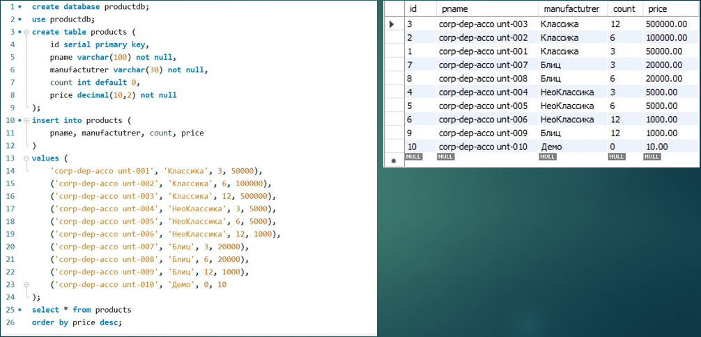

QA Portfolio - Igor Cherkasov

> Начинающий QA-инженер с фокусом на качество, безопасность и автоматизацию.  
> Умею не только находить баги - умею их документировать, воспроизводить и проверять на всех уровнях: от UI до базы данных.

---

Обо мне

Я увлечён тестированием как инструментом обеспечения надёжности ПО. Мои ключевые принципы:

- Тест-дизайн - основа всего: перед автоматизацией - чёткие сценарии.
- Безопасность - не опция: никогда не коммичу секреты, использую `.env` и GitHub Secrets.
- Данные должны совпадать: если API говорит одно, а БД другое - это баг.
- Автоматизация - помощник, а не цель: пишу скрипты с поддержкой ИИ-ассистента (аналогично работе с GitHub Copilot),
  которые реально экономят время.

Сейчас углубляюсь в Playwright, API-тестирование и валидацию данных,
а также изучаю практики CI/CD и интеграции с системами отслеживания задач.

---

Навыки

---

Практические работы

Анализ требований и тест-дизайн:

    1. Анализ веб-сайта:
        1.1. Сайт интернет-банка БСПБ https://idemo.bspb.ru/.
        1.2. Определил основные функциональные элементы данного сайта.
        1.3. Описал 5 сценариев использования на форме входа в личный кабинет:
     	    - С1: Успешный доступ в личный кабинет зарегистрированного юридического лица с корректными
                  учетными данными;
            - С2: Успешное перенаправление с «Юридическое лицо» на «Физическое лицо» при нажатии на
                  гиперссылку;
            - С3: Проверка безопасности при входе с неверным паролем;
            - С4: Просмотр введенного пароля в открытом виде;
            - С5: Проверка восстановления доступа в личный кабинет интернет-банка.
    2. Тест-кейсы;
    3. Баг-репорты.

[🔗 Пример](./Practice_on_the_course/web_banking_testing/online_banking_content.md)

---

Мобильное тестирование. Отчет о тестировании:

    1. При тестировании мобильного приложения «Лемана ПРО» работа велась на физическом устройстве
       (Xiaomi 12) - это критически важно для проверки реального пользовательского опыта.
    2. Я проверил 5 модулей, включая тестирование безопасности. И здесь - ключевая находка:
       приложение оказалось уязвимо к SQL-инъекциям, что приводило к сбою интерфейса. Это критическая
       уязвимость. Мой вывод как тестировщика: билд не может быть рекомендован к выпуску до устранения
       этой проблемы. Найдено 3 дефекта, 2 из них — критические.
    3. Дополнительно я провел тестирование на эмуляторе и закрепил тезис, что тестирование на физических
       устройствах остается незаменимым и критически важным этапом обеспечения качества ПО, особенно для
       мобильных. Мой подход показал, что есть категории дефектов, которые невозможно или крайне сложно
       обнаружить виртуальными средствами.

[🔗 Пример](./Practice_on_the_course/mobile_app_testing/lemanapro_test_report.md)

---

Тестирование API и автоматизация:

    1. Используя инструмент, который эмулирует REST API: reqres.in - я отработал навык тестирования API
       в Postman. Я создал коллекцию, применив все основные HTTP-методы: GET, POST, PUT, PATCH, DELETE.

[🔗 Тестирование API Reqres.in](./Practice_on_the_course/api_testing_postman/API_testing.md)

---

    2. API-тестирование HiTE PRO Gateway (боевое окружение)
       - Цель не просто проверить шлюз, а научиться работать с инструментами Postman, Newman, GitHub
         Actions.

[🔗 API-тестирование HiTE PRO Gateway через Postman + Newman](https://github.com/cheryst24-code-qa/hite-pro-test-postman)

---

    3. Автоматизированное API-тестирование HiTE PRO Gateway (боевое окружение)
       - Playwright + JavaScript, полное покрытие спецификации
       - CI/CD через GitHub Actions, Telegram-уведомления, HTML-отчёты

[🔗 Автоматизированное API-тестирование HiTE PRO Gateway](https://github.com/cheryst24-code-qa/hitepro-api-tests)

---

Базы данных

    1. Чтобы проверять не только интерфейс, но и целостность данных, я выполнил задачу по SQL. Создал базу,
       таблицу, заполнил её и выполнил сортировку. Этот навык позволяет напрямую верифицировать данные
       после действий в приложении.

🔗 Пример

    2. Имея прямой доступ к MS SQL: ЛЭРС УЧЁТ, я выполнил запросы в режиме только чтение (SELECT) в
       тестовом окружении LERS. Каждый пример решает конкретную тестовую задачу - от валидации
       бизнес-логики до поиска скрытых дефектов.

[🔗 Тестирование через данные: работа с БД LERS (MSSQL)](./Practice_on_the_course/sql_queries/working_with_the_database.md)

---

    3. Получив доступ к MS SQL: ЛЭРС УЧЁТ (тестовое окружение) сервера ЛЭРС УЧЁТ (боевое окружение),
       я провел сравнение данных между
       REST API и MS SQL Server.

[🔗 Валидация данных API и БД системы ЛЭРС](https://github.com/cheryst24-code-qa/lers-api-db-check)

---

[UI-автоматизация (demoshopping.ru)](https://github.com/cheryst24-code-qa/demo-shopping-playwright)

- End-to-end сценарии: регистрация, поиск, корзина, заказ
- Кросс-браузерность и адаптивность

---

Контакты

- **Telegram**: [@CodeQ_Ch](https://t.me/CodeQ_Ch)
- **Email**: cheryst@internet.ru
- **GitHub**: [cheryst24-code-qa](https://github.com/cheryst24-code-qa)

> Готов к стажировке, entry-level позиции в QA!
